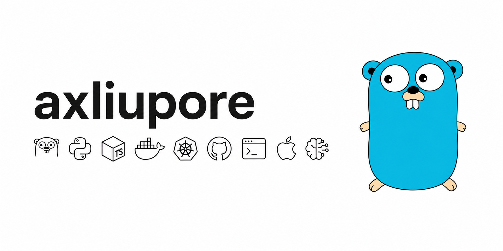

---

I write Go. I'm a student at YuZhang Normal University.  
I build with containers and infrastructure, and I explore  
the space where systems meet AI.

- 🧐 interested in Go, infrastructure, containers, AI tooling
- 🌱 currently learning Go runtimes, Kubernetes, Linux internals
- 💭 exploring Go runtimes, tool-use architectures, and LLM orchestration

        

---

📫 axliupore@gmail.com
